# claude-skill-for-video

[Claude Code](https://claude.com/claude-code) skills that make animated videos with no footage. Describe the idea, Claude writes a small spec, and the video is rendered on your own computer: 9:16 by default, any size on request.

- **`/styles`**: one scene in **101 animation styles**, from hand-drawn, cel and anime to claymation, pixel art, VHS, kinetic type and projection mapping. See the [gallery](#style-gallery) below and the full [style catalogue](STYLES.md).
- **15 specialist skills** for particular kinds of video (below).

## Specialist skills

**Explainers with characters**

| Skill | What it makes |
|---|---|
| `/cartoon-3d` | A 3D cartoon "what if" explainer (three.js): cartoon people, props, slow-motion impacts |
| `/stick-figure` | A bright stick-figure explainer with captions, whip transitions and sound effects |
| `/pixel-world` | A 2D pixel-art world with chunky outlined characters, speech bubbles and 171 pixel effects. Two art styles: Alex's Claude Pixel World and Growtopia |
| `/looks` | A worker carrying papers (a sheet slips) in 9 looks: hologram, cyberpunk, paper, blueprint, thermal, anime, ASCII, watercolour, claymation |
| `/chalkboard` | A chalk neural-network diagram: predict, compare, adjust |
| `/minimalistic-graphics` | Black-and-white line-art animation |

**Data, diagrams and technical**

| Skill | What it makes |
|---|---|
| `/coin-chart` | A bar chart of stacked 3D gold coins (made-up numbers are marked illustrative) |
| `/graph` | A minimal animated line graph |
| `/isometric` | An isometric source-to-home diagram: power station, cables, pulses, a house lighting up |
| `/blueprint` | A dimensioned robot-arm blueprint that traces itself on a cyan grid |
| `/breakdown` | A 3D exploded view: a phone comes apart into 9 layers and the view orbits it |
| `/hologram-hud` | A holographic wireframe drone with HUD arcs, scan lines and callouts |
| `/map-route` | A 3D map with an animated route |

**Scenes and title cards**

| Skill | What it makes |
|---|---|
| `/neon-flight` | A looping synthwave flight through a neon wireframe canyon |
| `/poster` | An illustrated landscape poster, travel or watercolour look |

## Style gallery
Every picture is a frame from a real render. Use the name under it with `/styles`, for example `{"style": "claymation"}`. Styles that are duplicates of another (same look, different sheet number) are listed in [STYLES.md](STYLES.md) but not repeated here.

<!-- styles-gallery:start (generated by tools/styles_doc.py) -->

Each entry shows the reference picture (left) next to what `/styles` renders (right). Every character style has its own character.

### A. Traditional 2D

<table>
<tr><td align="center" valign="top" width="50%"><b>1. Traditional Hand-Drawn</b><br><sub>Reference not shown (it has a studio character). This style uses an original character in the same look.</sub> <br><code>traditional-hand-drawn</code></td><td align="center" valign="top" width="50%"><b>2. Cel Animation</b><br><sub>Reference not shown (it has a studio character). This style uses an original character in the same look.</sub> <br><code>cel</code></td></tr>
<tr><td align="center" valign="top" width="50%"><b>3. Limited Animation</b><br>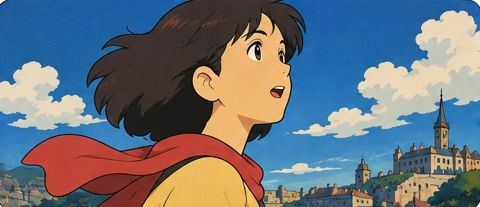 <br><code>limited</code></td><td align="center" valign="top" width="50%"><b>4. Rotoscope</b><br>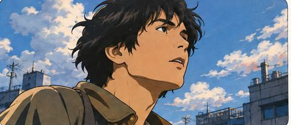 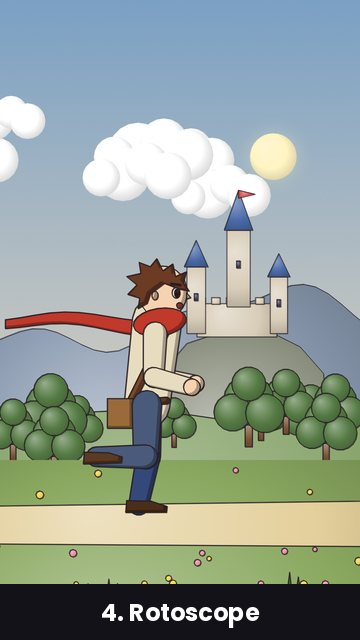<br><code>rotoscope</code></td></tr>
<tr><td align="center" valign="top" width="50%"><b>5. Cutout Animation</b><br><sub>Reference not shown (it has a studio character). This style uses an original character in the same look.</sub> 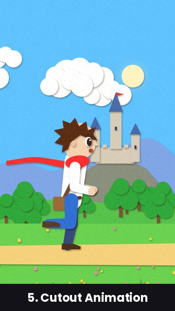<br><code>cutout</code></td><td align="center" valign="top" width="50%"><b>7. Digital 2D Animation</b><br>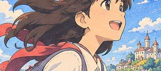 <br><code>digital-2d</code></td></tr>
<tr><td align="center" valign="top" width="50%"><b>12. Silhouette Animation</b><br>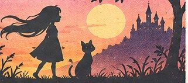 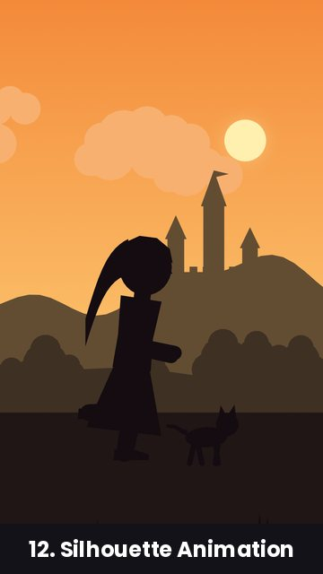<br><code>silhouette</code></td><td align="center" valign="top" width="50%"><b>20. Full Animation</b><br>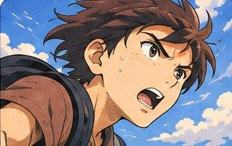 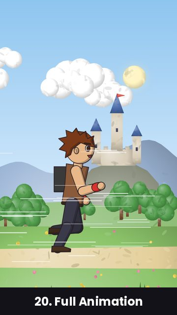<br><code>full-animation</code></td></tr>
<tr><td align="center" valign="top" width="50%"><b>24. Flipbook Animation</b><br>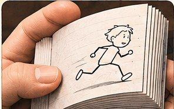 <br><code>flipbook</code></td><td align="center" valign="top" width="50%"><b>89. Frame-by-Frame Animation</b><br><sub>From the written style guide (no reference sheet).</sub> <br><code>frame-by-frame</code></td></tr>
<tr><td align="center" valign="top" width="50%"><b>90. Sketch Animation</b><br><sub>From the written style guide (no reference sheet).</sub> <br><code>sketch</code></td></tr>
</table>

### B. Anime and Japanese-inspired

<table>
<tr><td align="center" valign="top" width="50%"><b>6. Anime-Style Animation</b><br>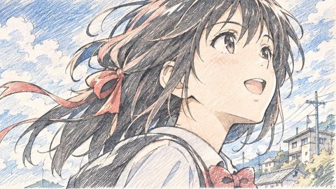 <br><code>anime-style</code></td><td align="center" valign="top" width="50%"><b>13. Manga Style</b><br>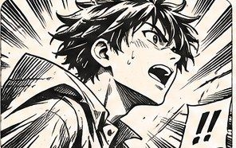 <br><code>manga</code></td></tr>
<tr><td align="center" valign="top" width="50%"><b>14. Watercolor Anime</b><br>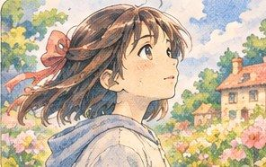 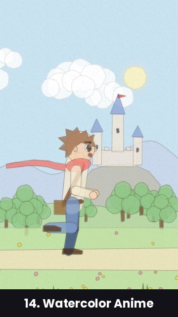<br><code>watercolor-anime</code></td><td align="center" valign="top" width="50%"><b>15. Anime Pixel Art</b><br>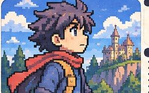 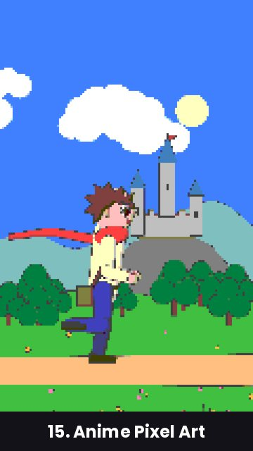<br><code>anime-pixel</code></td></tr>
<tr><td align="center" valign="top" width="50%"><b>16. Anime Rotoscope</b><br>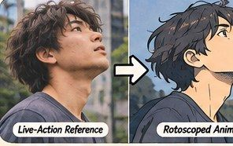 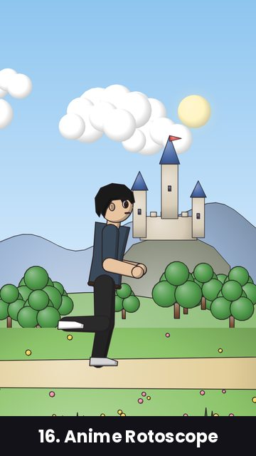<br><code>anime-rotoscope</code></td><td align="center" valign="top" width="50%"><b>92. Traditional Anime</b><br><sub>From the written style guide (no reference sheet).</sub> <br><code>traditional-anime</code></td></tr>
<tr><td align="center" valign="top" width="50%"><b>93. 90s Retro Anime</b><br><sub>From the written style guide (no reference sheet).</sub> <br><code>90s-anime</code></td><td align="center" valign="top" width="50%"><b>94. Sakuga</b><br><sub>From the written style guide (no reference sheet).</sub> <br><code>sakuga</code></td></tr>
<tr><td align="center" valign="top" width="50%"><b>95. Chibi Animation</b><br><sub>From the written style guide (no reference sheet).</sub> 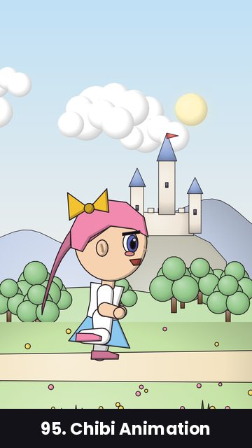<br><code>chibi</code></td></tr>
</table>

### C. Western cartoon

<table>
<tr><td align="center" valign="top" width="50%"><b>17. Classic American Cartoon</b><br><sub>Reference not shown (it has a studio character). This style uses an original character in the same look.</sub> <br><code>classic-american</code></td><td align="center" valign="top" width="50%"><b>18. Modern Television Cartoon</b><br><sub>Reference not shown (it has a studio character). This style uses an original character in the same look.</sub> 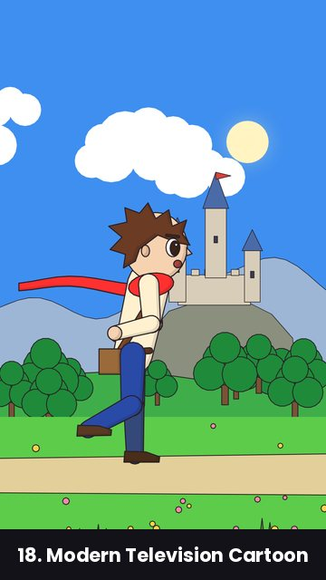<br><code>modern-tv</code></td></tr>
<tr><td align="center" valign="top" width="50%"><b>91. Rubber Hose Animation</b><br><sub>From the written style guide (no reference sheet).</sub> 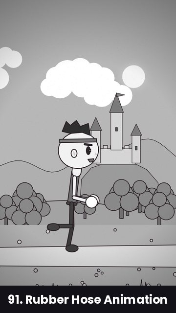<br><code>rubber-hose</code></td><td align="center" valign="top" width="50%"><b>96. Adult Sitcom Cartoon</b><br><sub>From the written style guide (no reference sheet).</sub> 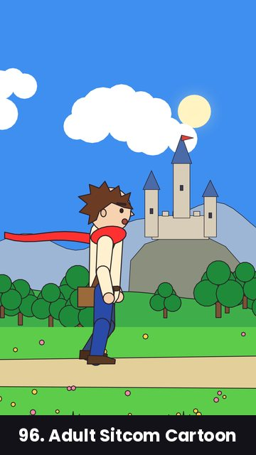<br><code>adult-sitcom</code></td></tr>
<tr><td align="center" valign="top" width="50%"><b>97. Exaggerated Cartoon</b><br><sub>From the written style guide (no reference sheet).</sub> <br><code>exaggerated</code></td><td align="center" valign="top" width="50%"><b>98. Minimalist Cartoon</b><br><sub>From the written style guide (no reference sheet).</sub> <br><code>minimalist</code></td></tr>
<tr><td align="center" valign="top" width="50%"><b>99. Comic Strip Animation</b><br><sub>From the written style guide (no reference sheet).</sub> 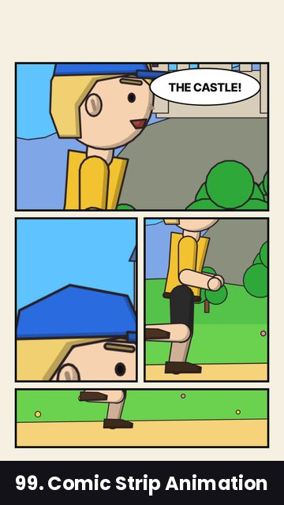<br><code>comic-strip</code></td><td align="center" valign="top" width="50%"><b>100. Storybook Cartoon</b><br><sub>From the written style guide (no reference sheet).</sub> <br><code>storybook</code></td></tr>
<tr><td align="center" valign="top" width="50%"><b>101. Gothic Cartoon</b><br><sub>From the written style guide (no reference sheet).</sub> <br><code>gothic</code></td></tr>
</table>

### D. 3D

<table>
<tr><td align="center" valign="top" width="50%"><b>25. Stylized 3D</b><br>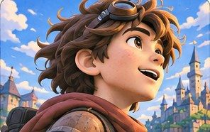 <br><code>stylized-3d</code></td><td align="center" valign="top" width="50%"><b>26. Photorealistic CGI</b><br>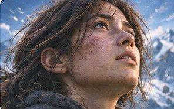 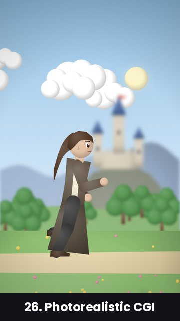<br><code>photorealistic</code></td></tr>
<tr><td align="center" valign="top" width="50%"><b>27. Low Poly Animation</b><br>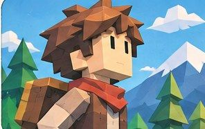 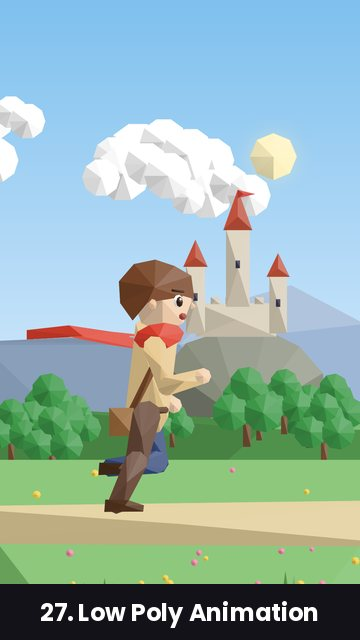<br><code>low-poly</code></td><td align="center" valign="top" width="50%"><b>28. Cel-Shaded 3D</b><br> 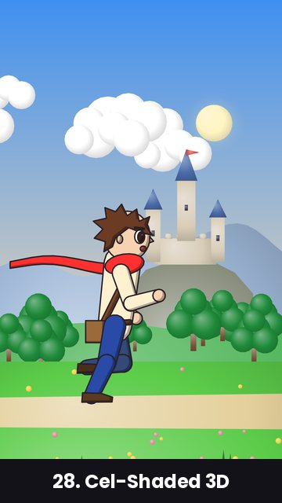<br><code>cel-shaded-3d</code></td></tr>
<tr><td align="center" valign="top" width="50%"><b>29. Voxel Animation</b><br>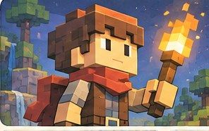 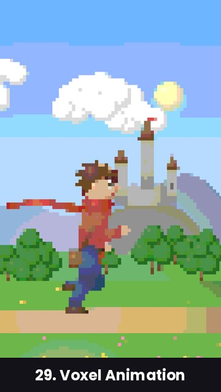<br><code>voxel</code></td><td align="center" valign="top" width="50%"><b>30. Isometric 3D</b><br>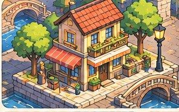 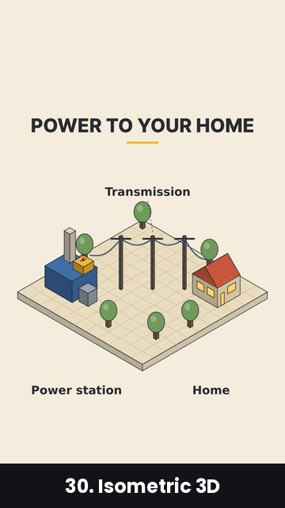<br><code>isometric-3d</code></td></tr>
<tr><td align="center" valign="top" width="50%"><b>31. Digital Clay</b><br>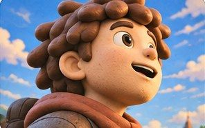 <br><code>digital-clay</code></td><td align="center" valign="top" width="50%"><b>32. 2.5D Animation</b><br><sub>Reference not shown (it has a studio character). This style uses an original character in the same look.</sub> 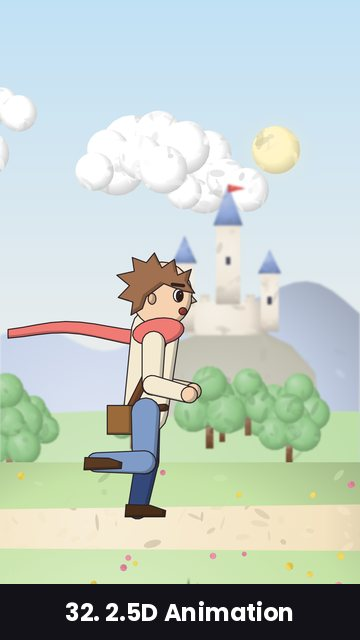<br><code>2-5d</code></td></tr>
</table>

### E. Stop motion

<table>
<tr><td align="center" valign="top" width="50%"><b>9. Stop Motion Animation</b><br><sub>Reference not shown (it has a studio character). This style uses an original character in the same look.</sub> <br><code>stop-motion</code></td><td align="center" valign="top" width="50%"><b>10. Claymation</b><br><sub>Reference not shown (it has a studio character). This style uses an original character in the same look.</sub> <br><code>claymation</code></td></tr>
<tr><td align="center" valign="top" width="50%"><b>11. Puppet Animation</b><br>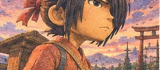 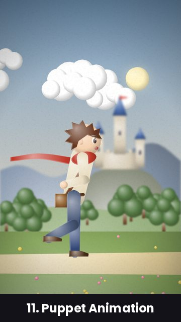<br><code>puppet</code></td><td align="center" valign="top" width="50%"><b>35. Paper Cutout Stop Motion</b><br>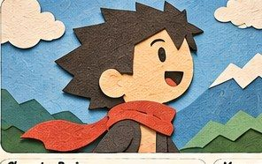 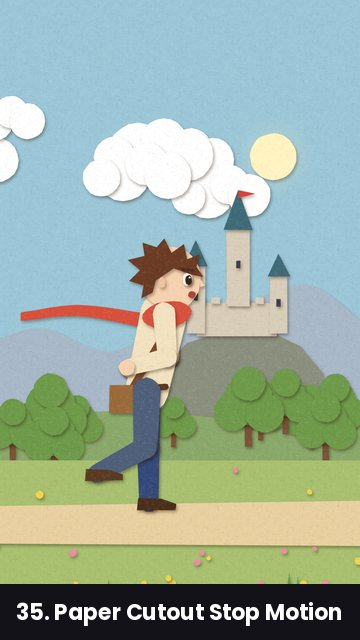<br><code>paper-cutout-stop-motion</code></td></tr>
<tr><td align="center" valign="top" width="50%"><b>36. Brick Toy Animation</b><br><sub>Reference not shown (it has a studio character). This style uses an original character in the same look.</sub> 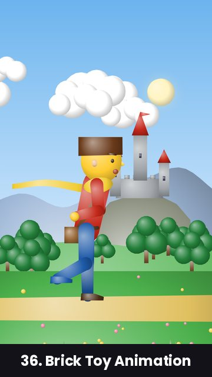<br><code>brick-toy</code></td><td align="center" valign="top" width="50%"><b>37. Pixilation</b><br>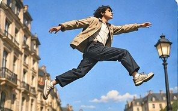 <br><code>pixilation</code></td></tr>
<tr><td align="center" valign="top" width="50%"><b>38. Sand Animation</b><br> 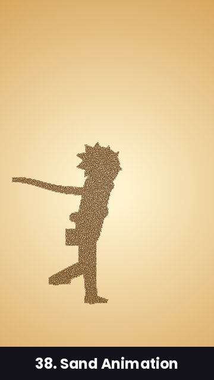<br><code>sand</code></td><td align="center" valign="top" width="50%"><b>39. Paint-on-Glass Animation</b><br>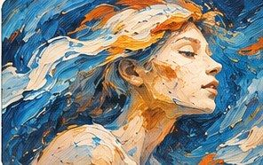 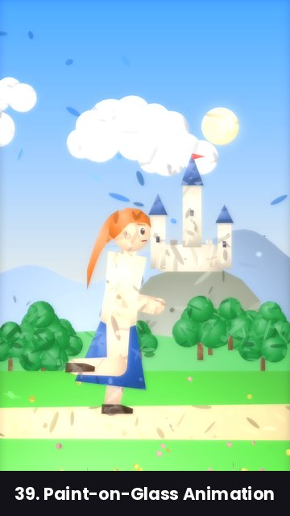<br><code>paint-on-glass</code></td></tr>
<tr><td align="center" valign="top" width="50%"><b>40. Object Animation</b><br> 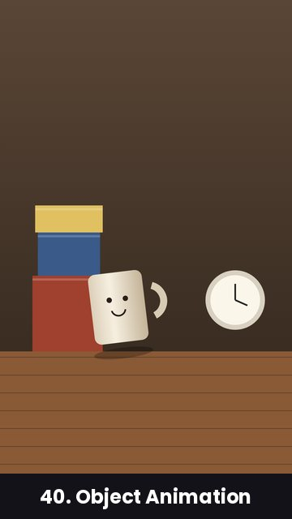<br><code>object</code></td></tr>
</table>

### F. Motion graphics

<table>
<tr><td align="center" valign="top" width="50%"><b>41. Motion Graphics</b><br> 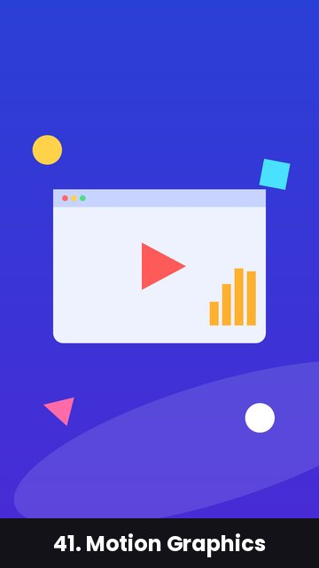<br><code>motion-graphics</code></td><td align="center" valign="top" width="50%"><b>42. Kinetic Typography</b><br>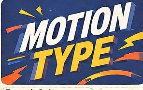 <br><code>kinetic-typography</code></td></tr>
<tr><td align="center" valign="top" width="50%"><b>43. Infographic Animation</b><br> <br><code>infographic</code></td><td align="center" valign="top" width="50%"><b>44. Logo Animation</b><br>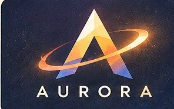 <br><code>logo</code></td></tr>
<tr><td align="center" valign="top" width="50%"><b>45. Whiteboard Animation</b><br>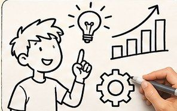 <br><code>whiteboard</code></td><td align="center" valign="top" width="50%"><b>46. HUD Animation</b><br>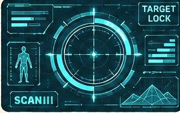 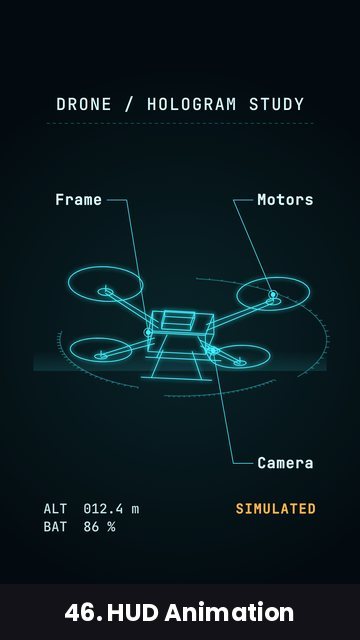<br><code>hud</code></td></tr>
<tr><td align="center" valign="top" width="50%"><b>47. Liquid Motion</b><br>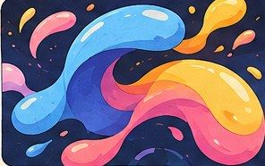 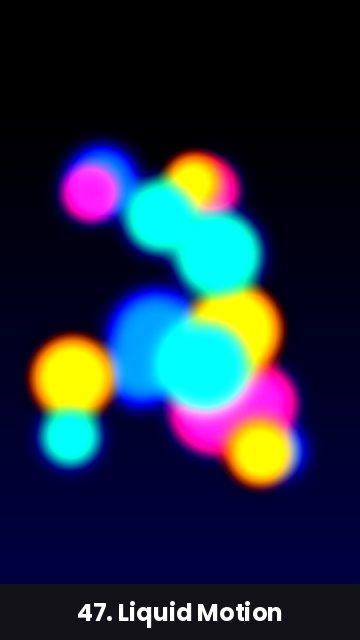<br><code>liquid</code></td><td align="center" valign="top" width="50%"><b>48. Geometric Animation</b><br>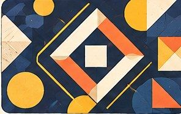 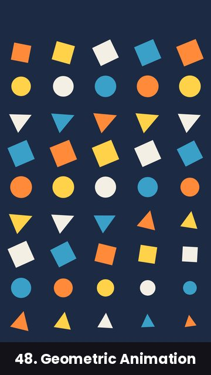<br><code>geometric</code></td></tr>
</table>

### G. Experimental and artistic

<table>
<tr><td align="center" valign="top" width="50%"><b>50. Mixed Media Animation</b><br>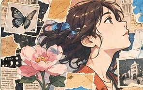 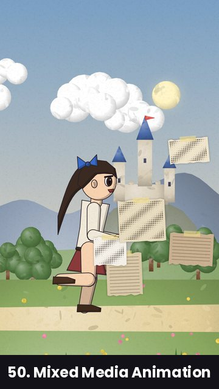<br><code>mixed-media</code></td><td align="center" valign="top" width="50%"><b>51. Surreal Animation</b><br>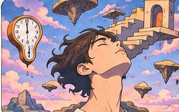 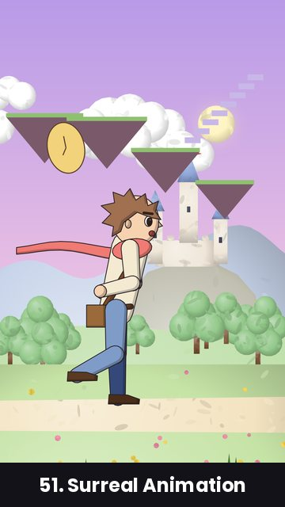<br><code>surreal</code></td></tr>
<tr><td align="center" valign="top" width="50%"><b>52. Abstract Animation</b><br>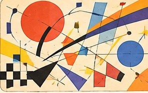 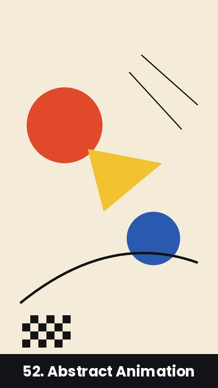<br><code>abstract</code></td><td align="center" valign="top" width="50%"><b>53. Glitch Animation</b><br>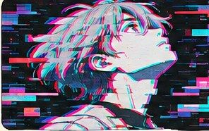 <br><code>glitch</code></td></tr>
<tr><td align="center" valign="top" width="50%"><b>54. Psychedelic Animation</b><br>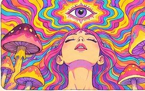 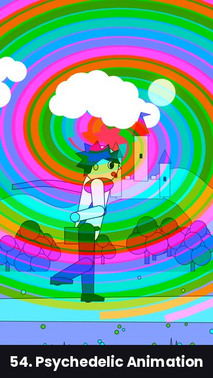<br><code>psychedelic</code></td><td align="center" valign="top" width="50%"><b>55. Ink Animation</b><br> 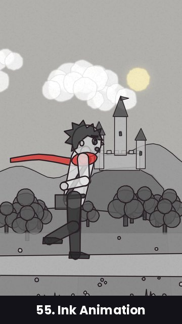<br><code>ink</code></td></tr>
<tr><td align="center" valign="top" width="50%"><b>56. Charcoal Animation</b><br> 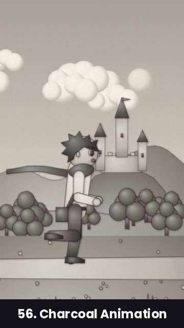<br><code>charcoal</code></td></tr>
</table>

### H. Pixel and retro digital

<table>
<tr><td align="center" valign="top" width="50%"><b>57. 8-Bit Pixel Art</b><br>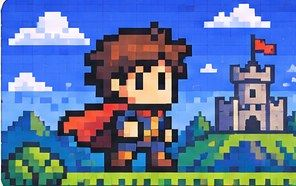 <br><code>8-bit</code></td><td align="center" valign="top" width="50%"><b>58. 16-Bit Pixel Art</b><br>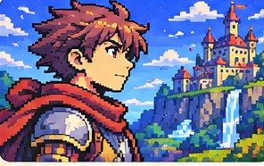 <br><code>16-bit</code></td></tr>
<tr><td align="center" valign="top" width="50%"><b>59. High-Resolution Pixel Art</b><br> <br><code>hi-res-pixel</code></td><td align="center" valign="top" width="50%"><b>60. VHS Animation</b><br>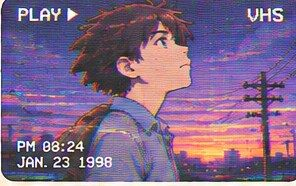 <br><code>vhs</code></td></tr>
<tr><td align="center" valign="top" width="50%"><b>61. Retro CGI</b><br> <br><code>retro-cgi</code></td><td align="center" valign="top" width="50%"><b>62. Dither Animation</b><br>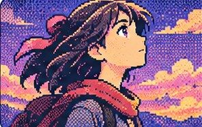 <br><code>dither</code></td></tr>
</table>

### I. Internet and social media

<table>
<tr><td align="center" valign="top" width="50%"><b>23. Stick Figure Animation</b><br>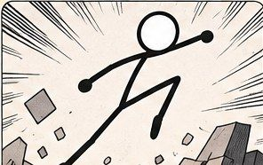 <br><code>stick-figure</code></td><td align="center" valign="top" width="50%"><b>64. Doodle Animation</b><br>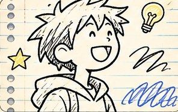 <br><code>doodle</code></td></tr>
<tr><td align="center" valign="top" width="50%"><b>65. Faceless Storytelling</b><br>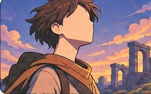 <br><code>faceless</code></td><td align="center" valign="top" width="50%"><b>66. Comic Book Animation</b><br>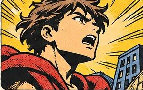 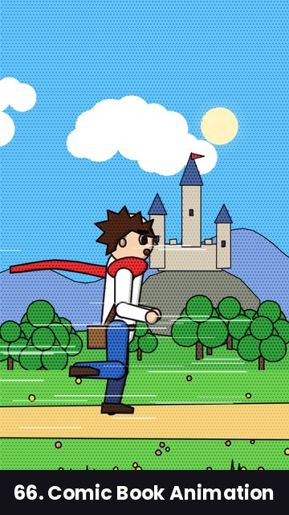<br><code>comic-book</code></td></tr>
<tr><td align="center" valign="top" width="50%"><b>67. Motion Comic</b><br>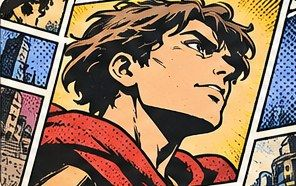 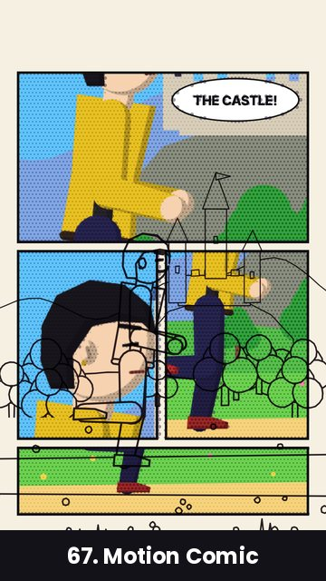<br><code>motion-comic</code></td><td align="center" valign="top" width="50%"><b>68. Documentary Animation</b><br> <br><code>documentary</code></td></tr>
<tr><td align="center" valign="top" width="50%"><b>69. Game-Based Animation</b><br><sub>Reference not shown (it has a studio character). This style uses an original character in the same look.</sub> <br><code>game-based</code></td><td align="center" valign="top" width="50%"><b>70. Meme Animation</b><br><sub>Reference not shown (it has a studio character). This style uses an original character in the same look.</sub> 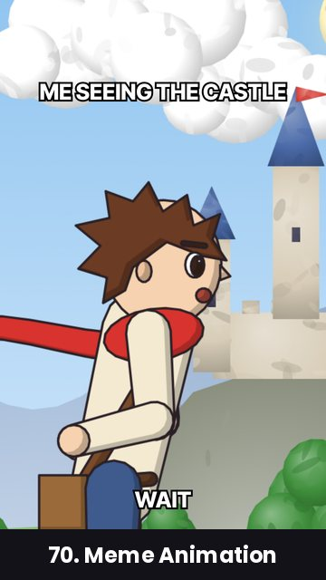<br><code>meme</code></td></tr>
<tr><td align="center" valign="top" width="50%"><b>71. AI-Generated Animation</b><br> 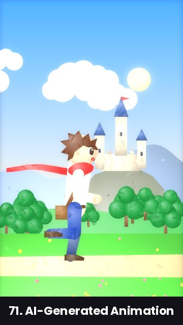<br><code>ai-generated</code></td><td align="center" valign="top" width="50%"><b>72. Parallax Storytelling</b><br>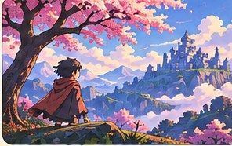 <br><code>parallax</code></td></tr>
</table>

### J. Specialized

<table>
<tr><td align="center" valign="top" width="50%"><b>73. Motion Capture</b><br>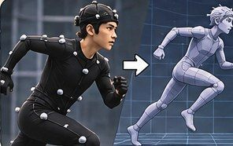 <br><code>motion-capture</code></td><td align="center" valign="top" width="50%"><b>74. Performance Capture</b><br>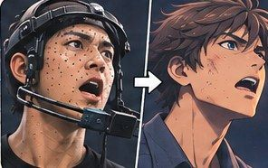 <br><code>performance-capture</code></td></tr>
<tr><td align="center" valign="top" width="50%"><b>75. Procedural Animation</b><br>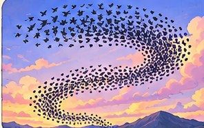 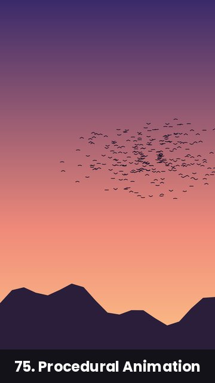<br><code>procedural</code></td><td align="center" valign="top" width="50%"><b>76. Physics-Based Animation</b><br>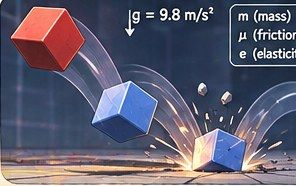 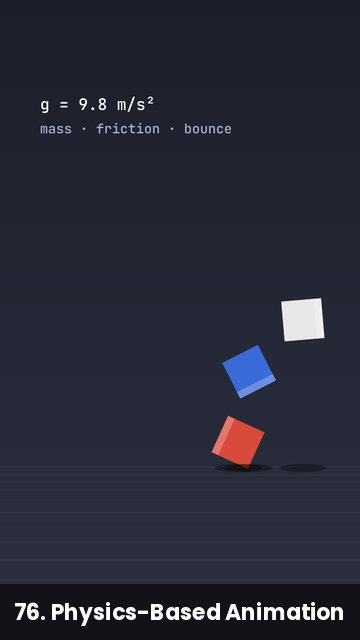<br><code>physics</code></td></tr>
<tr><td align="center" valign="top" width="50%"><b>77. Skeletal Animation</b><br>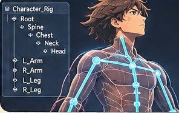 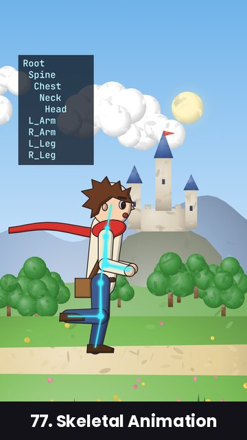<br><code>skeletal</code></td><td align="center" valign="top" width="50%"><b>78. Morph Animation</b><br>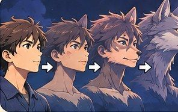 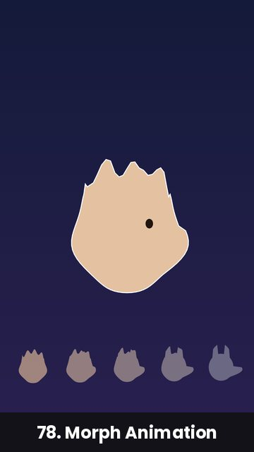<br><code>morph</code></td></tr>
<tr><td align="center" valign="top" width="50%"><b>79. Particle Animation</b><br> 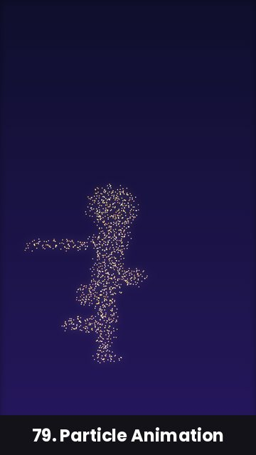<br><code>particles</code></td><td align="center" valign="top" width="50%"><b>80. Fluid Simulation</b><br>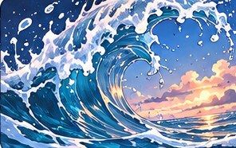 <br><code>fluid</code></td></tr>
<tr><td align="center" valign="top" width="50%"><b>81. Mechanical Animation</b><br>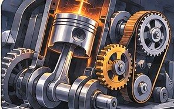 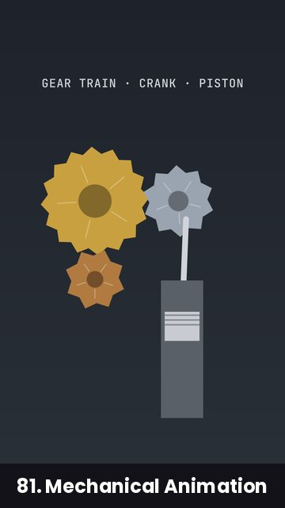<br><code>mechanical</code></td><td align="center" valign="top" width="50%"><b>82. Architectural Animation</b><br>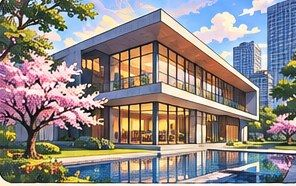 <br><code>architectural</code></td></tr>
<tr><td align="center" valign="top" width="50%"><b>83. Medical Animation</b><br>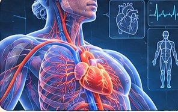 <br><code>medical</code></td><td align="center" valign="top" width="50%"><b>84. Scientific Animation</b><br>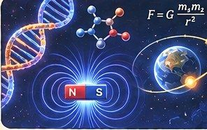 <br><code>scientific</code></td></tr>
<tr><td align="center" valign="top" width="50%"><b>85. VR Animation</b><br>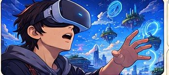 <br><code>vr</code></td><td align="center" valign="top" width="50%"><b>86. AR Animation</b><br>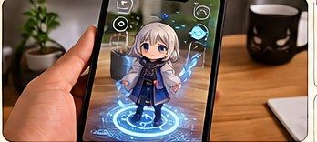 <br><code>ar</code></td></tr>
<tr><td align="center" valign="top" width="50%"><b>87. Real-Time Animation</b><br>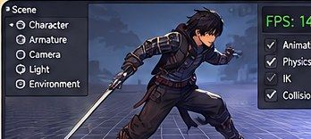 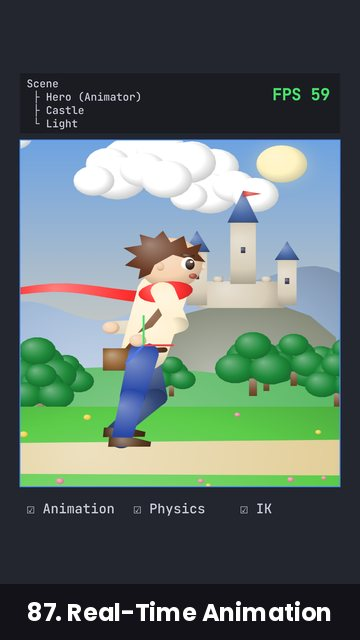<br><code>real-time</code></td><td align="center" valign="top" width="50%"><b>88. Projection Mapping</b><br>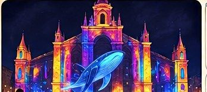 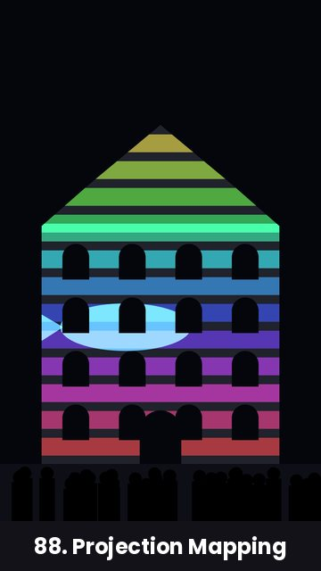<br><code>projection-mapping</code></td></tr>
</table>
<!-- styles-gallery:end -->

## Install
```bash
git clone https://github.com/alexlukman/claude-skill-for-video
cd claude-skill-for-video
bash install.sh
```
`install.sh` links each skill into `~/.claude/skills/` and installs the render kit (three.js, GSAP, Playwright, all pinned in `kit/package-lock.json`). You need Node, Python 3 and ffmpeg, plus Chrome or Chromium (set `CHROME=/path/to/chrome` if needed). Then in Claude Code, run for example `/pixel-world`.

## How it works
The 2D skills (`/styles` and the scene skills) share `kit/scene2d/`: a canvas page, helpers (`lib.js`), a Playwright renderer and a builder. Each skill is one or more scripts with a `renderAt(t)` that depends only on time, a `build.py` with defaults and checks, and a `SKILL.md`. Every one renders 1080x1920, 30 fps, 6 s, H.264 yuv420p, and `build.py <spec> --check` writes stills at 0, 1, 3, 5 and 5.9 s and warns about text that does not fit. Any of them can also take `"filter": "ascii" | "thermal" | "crt"` to post-process every frame. `/styles` describes each style as a recipe in `skills/styles/catalog.json` (palette, fill, line, timing, texture, pixel grid, post effects, camera, overlay or its own scene); `STYLES.md` and this gallery are generated from it by `tools/styles_doc.py`.

## Other screen sizes
Everything renders as 9:16 first. Add `"size": "1920x1080"` (or `"16:9"`, `"1:1"`, `"4:5"`, any WIDTHxHEIGHT) to a spec to fit the video into that frame, with the sides filled by a blurred copy (`"fill": "blur"`) or a colour, and an optional `"zoom"` to enlarge it. For any finished video: `python3 kit/resize.py video.mp4 --size 16:9`.

## What changed from the original
- **`/styles`** (new): a 101-style animation catalogue built from Alex's 88 reference sheets and his style guide, one shared original scene redrawn by style recipes, plus scenes for graphic, simulation and technology styles. The reference sheets themselves are not in the repo.
This project started from [claude-animation-skills](https://github.com/artemnovitckii/claude-animation-skills) by Artem Novitckii (MIT). Changes:
- **`/cartoon-3d`** (was `/zach-d-films`): the faces no longer wobble. The head is one smooth surface, features are placed on it by ray-casting, the jaw stays still and the mouth only opens and closes.
- **`/breakdown`**: 9 layers instead of 6, and after the parts separate the view turns around the stack, with label dots tracking each part.
- **`/pixel-world`**: new skill, with its own pixel engine, bitmap font, characters, world and renderer, plus pixel effects bundled from [pixelfx](https://github.com/patch-gg/pixelfx) (MIT, Patch and Hugo Duprez; rebuild with `tools/bundle-pixelfx.sh`).
- **Seven new scene skills** (`/isometric`, `/coin-chart`, `/neon-flight`, `/blueprint`, `/hologram-hud`, `/chalkboard`, `/poster`), written from scene descriptions in community prompt collections. The code is original; no code was copied from lemo-opuscar, ClaudeAnimationBase or the prompt repositories.
- The kit pins GSAP through npm instead of downloading it from a CDN, and uses a patched Playwright.

## Safety notes
Everything runs locally. The skills make no network calls at render time. `kit/setup.sh` downloads npm packages (pinned) and, only for `/stick-figure` voice-over, speech model files from GitHub releases. Review `kit/setup.sh` and `install.sh` before running them, as you would with any script.

## License
MIT. The original code is © Artem Novitckii; additions are © Alexander Valentino Lukman. The bundled pixelfx effects are © Patch and Hugo Duprez (MIT, notice kept in the bundle header). Characters and worlds are original designs and are not affiliated with any game or studio.
